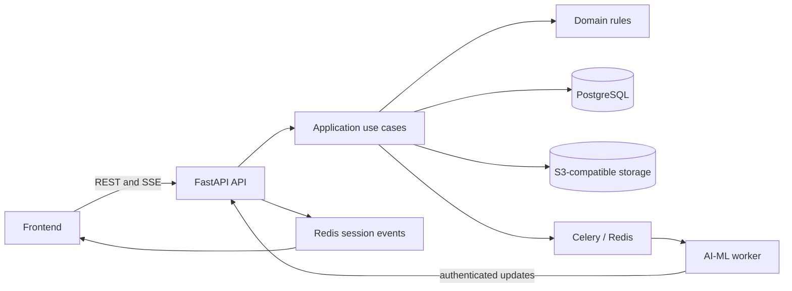

# VirtuJudge Backend

The VirtuJudge backend is the product control plane for pitch-practice sessions. It owns the data and rules that turn a team's uploaded material into a practice session: authorization, immutable input manifests, AI-job dispatch, grounded Q&A, reports, exports, and erasure requests.

It is a FastAPI application built around four layers. PostgreSQL is the source of truth for product state. Redis is used for Celery job delivery, rate limiting, and live session notifications; it is never the source of business truth. AI processing runs in the separate [AI-ML repository](https://github.com/VirtuJudge/AI-ML), which can write only its own derived data and must report results through the backend's internal contract.

## What it owns

- users, teams, memberships, invitations, and project access;
- private, versioned assets and direct signed uploads to S3-compatible storage;
- practice-session state, consent, frozen manifests, retries, cancellation, and speaker mappings;
- durable AI jobs, callback sequence checks, result validation, and browser notifications;
- the Q&A round, including exactly three primary questions and at most two follow-ups;
- evaluations, feedback for the team and every mapped speaker, PDF exports, and data-erasure state.

The backend is deliberately not an AI inference service. It authorizes requests, stores the workflow state, gives workers scoped input references, and accepts only contract-valid results.

## Architecture



Dependencies point inward:

| Layer | Location | Responsibility |
| --- | --- | --- |
| Domain | `app/domain/` | Framework-free entities, state transitions, scoring rules, and domain errors. |
| Application | `app/application/` | Use cases and ports. `SessionWorkflow`, `AIJobs`, and `AssetStore` keep workflow, queue, and object-key rules out of routes. |
| API | `app/api/` | FastAPI routers, request validation, authentication context, Problem Details responses, correlation IDs, and SSE. |
| Infrastructure | `app/infrastructure/` | SQLAlchemy repositories, Redis/Celery, S3, OIDC, mail, media/document validation, and PDF adapters. |

`app/main.py` is the composition root. Domain and application code must not import FastAPI, SQLAlchemy, Redis, Celery, or provider SDKs.

## Core workflow

1. A team member uploads a presentation and optional supporting documents directly to private object storage with short-lived signed URLs. The backend verifies size, checksum, and file structure before a version can be used.
2. The member creates a Practice Session. Starting analysis records consent, freezes the exact asset-version manifest, creates an Analysis Attempt and an AI Job in one transaction, then enqueues the job after commit.
3. The AI worker claims the job and sends ordered, authenticated updates to `/internal/v1/ai-jobs/{job_id}/updates`. The backend ignores duplicate or stale sequences, validates completed results, and publishes safe progress events to the session's SSE stream.
4. The Q&A round exposes the three Primary Questions produced from the analysis. Submitted answers can produce no more than two grounded Follow-up Questions.
5. Once Q&A is complete, the backend serializes the validated Q&A artifact, dispatches report generation, validates the returned evaluation/report, and makes a PDF export available through another signed URL.

If queue delivery fails, the persisted job remains eligible for redispatch with backoff. A worker callback can therefore be retried without creating a second Analysis Attempt.

## Repository layout

```text
app/
├── api/                 HTTP routes, schemas, dependencies, errors, SSE
├── application/         use cases, workflows, ports, and application services
├── domain/              product entities, rules, statuses, and scoring
├── infrastructure/      database, storage, auth, queues, mail, PDF, media
├── main.py              application wiring and background schedulers
└── settings.py          typed environment configuration
contracts/               generated OpenAPI and versioned AI JSON schemas
migrations/              Alembic migrations for backend-owned product tables
tests/                   architecture, unit, integration, acceptance, system tests
scripts/                 quality checks, contract checks, and local-stack commands
local_stack/             Compose health and smoke checks
```

## Prerequisites

- Python 3.11 or newer
- [uv](https://docs.astral.sh/uv/)
- Docker Engine with Compose v2.17 or newer for the shared local stack
- FFmpeg for media-validation tests and the production image

The shared stack also expects sibling checkouts:

```text
VirtuJudge/
├── Backend/
├── Frontend/
└── AI-ML/
```

`Backend/scripts/local-stack.sh` checks that the frontend has `package.json` and `package-lock.json`, and that AI-ML has its Python project and worker entry point, before it starts anything.

## Run locally

### Backend on the host

Install the locked dependencies, create your ignored host configuration, apply migrations, and start FastAPI:

```bash
uv sync --locked
cp .env.example .env
uv run alembic upgrade head
uv run uvicorn app.main:app --reload
```

The API is then available at:

- API documentation: <http://localhost:8000/docs>
- OpenAPI document: <http://localhost:8000/openapi.json>
- Liveness endpoint: <http://localhost:8000/health>

`.env` is for host processes. If PostgreSQL, Redis, and MinIO are running through Compose, copy their generated credentials privately from `.env.local` into `.env` before running host tools. Do not run a host API server on port 8000 while the Compose backend is using that port.

### Shared local stack

From `Backend/`:

```bash
bash scripts/local-stack.sh up
bash scripts/local-stack.sh smoke
bash scripts/local-stack.sh status
bash scripts/local-stack.sh down
```

The first `up` generates an ignored `.env.local` with random credentials and mode `0600`, builds the Backend, Frontend, and AI worker, waits for health checks, then runs a storage smoke check. It does not clone, alter, or pin the sibling repositories.

| Service | Local address | Notes |
| --- | --- | --- |
| Frontend | <http://localhost:3000> | Starts with its existing mock API setting unless `NEXT_PUBLIC_MOCK_API` is changed. |
| Backend | <http://localhost:8000> | Health at `/health`; interactive API docs at `/docs`. |
| PostgreSQL + pgvector | `localhost:5432` | Database `virtujudge`; Backend and AI use separate roles. |
| Redis | `localhost:6379` | DB 0 is the diagnostic/job broker namespace; DB 1 holds cache keys. |
| MinIO API | <http://localhost:9000> | Private S3-compatible object store. |
| MinIO console | <http://localhost:9001> | Local storage administration. |
| AI worker | internal Compose service | Processes the local FakePipeline and reports through the internal API. |

`down` keeps the volumes and `.env.local`; `up` reuses them. If you intentionally replace `.env.local`, recreate the volumes too, because PostgreSQL roles retain their original passwords.

## Configuration

Start with [`.env.example`](.env.example). Keep `.env`, `.env.local`, production secrets, JWTs, signed URLs, private media, and provider responses out of Git and logs.

| Area | Important variables |
| --- | --- |
| Application | `APP_ENV`, `APP_HOST`, `APP_PORT`, `CORS_ALLOWED_ORIGINS` |
| Persistence and queue | `DATABASE_URL`, `REDIS_URL`, `REDIS_CACHE_URL`, `CELERY_BROKER_URL` |
| Object storage | `OBJECT_STORAGE_ENDPOINT`, `OBJECT_STORAGE_PUBLIC_ENDPOINT`, `OBJECT_STORAGE_BUCKET`, credentials, upload/download URL TTLs |
| Identity and workers | `OIDC_ISSUER`, `OIDC_AUDIENCE`, `OIDC_JWKS_URL`, `AI_WORKER_SHARED_SECRET` |
| Job recovery | `AI_JOB_DISPATCHER_*`, `AI_WORKER_TASK_NAME`, `AI_WORKER_QUEUE_NAME` |
| Asset retention | `ASSET_CLEANUP_*` |
| Mail | `MAIL_BACKEND`, Resend settings, or Gmail SMTP settings and `GMAIL_SMOKE_ALLOWLIST` |

The asset-cleanup and job-redispatch schedulers run by default outside tests. Tests disable them unless explicitly enabled. See [`app/settings.py`](app/settings.py) for defaults and validation, and the [deployment guide](docs/deployment-render-r2.md) for Render with Cloudflare R2.

### Mail

`MAIL_BACKEND=fake` is the default and is always used by Compose. It retains messages in memory and never sends mail. Production can use `resend` (the supported option for Render Free, which blocks outbound SMTP ports) or `gmail`. Gmail sending is only exercised through an explicit, allow-listed smoke command:

```bash
uv run python -m local_stack.gmail_smoke --recipient allowed@example.com --send
```

That command refuses to connect unless the recipient is in `GMAIL_SMOKE_ALLOWLIST` and `--send` is present.

## API and contracts

The interactive API reference at `/docs` and [`contracts/openapi.json`](contracts/openapi.json) are the public API source of truth. Main route groups cover:

| Area | Routes |
| --- | --- |
| Identity, teams, and projects | `/api/v1/me`, `/api/v1/teams`, `/api/v1/projects` |
| Assets | upload intents, verification completion, immutable versions, download intents, and erasure |
| Practice Sessions | draft creation, manifest editing, analysis attempts, cancellation, retry, speaker mapping, and session events |
| Q&A | Q&A state, answer-upload intents, answer submission, and skips |
| Reports | evaluation, report payload, PDF export, export status, and download intent |
| Workers | `/internal/v1/ai-jobs/{job_id}` and ordered status updates |

Public mutations use `Idempotency-Key` where repeated delivery must be safe. Versioned session updates use `ETag` and `If-Match` for optimistic concurrency. Errors use `application/problem+json` and never expose private inputs, provider bodies, secrets, or stack traces.

`GET /api/v1/practice-sessions/{session_id}/events` is an authenticated Server-Sent Events stream. Notifications expose only safe status, progress, IDs, versions, and correlation data. Clients reconnect with `Last-Event-ID`; a resync event tells them to refetch canonical REST state when the retained event history cannot satisfy that cursor.

The worker boundary uses versioned JSON schemas in [`contracts/schemas/`](contracts/schemas/). Queue messages and callbacks are intentionally small. Workers receive scoped artifact references, while the backend validates sequence numbers, ownership, attempt currency, question limits, evidence references, report feedback coverage, and scores before changing product state.

For endpoint details and the cross-repository contract, see:

- [Frontend–Backend API contract](https://github.com/VirtuJudge/Docs/blob/main/Contracts/Frontend-Backend-API.md)
- [Backend–AI contract](https://github.com/VirtuJudge/Docs/blob/main/Contracts/Backend-AI-Contract.md)
- [Event catalogue](https://github.com/VirtuJudge/Docs/blob/main/Contracts/Event-Catalogue.md)

## Assets, privacy, and retention

Browser clients upload directly to private object storage; large files never travel through API or queue payloads. An upload intent has an absolute expiry, and replaying it does not extend that deadline. Completion re-checks content length, checksum, media/document structure, and ownership before a version becomes verified.

Abandoned uploads are claimed with a lease, deleted from storage, and marked deleted transactionally. A delayed tombstone re-sweep catches objects that arrive after cleanup. Verified versions remain protected when a replacement is rejected or abandoned.

Every team-owned resource is authorized through Team Membership ancestry. OIDC verification checks issuer, audience, signature, expiry, and subject. Worker callbacks use a credential separate from user JWTs. Starting erasure revokes access immediately, while physical deletion follows the documented retention window.

## Database migrations

Backend-owned product tables use one Alembic history. Generate migrations from model changes, inspect the result, and test both directions before merging:

```bash
uv run alembic revision --autogenerate -m "describe change"
uv run alembic upgrade head
uv run alembic downgrade -1
```

The container startup command applies `alembic upgrade head` before Uvicorn starts. AI-ML owns only its `ai_*` tables and derived-object prefix; it must not modify Backend migrations or product tables.

## Quality checks

Run the full repository gate before opening a pull request:

```bash
uv sync --locked
bash scripts/check.sh
```

It checks required repository files, Ruff linting and formatting, strict mypy, OpenAPI and AI-contract snapshots, and the full pytest suite. The test layout is intentional:

| Test type | Focus |
| --- | --- |
| `tests/architecture/` | Inward dependency rules and boundary enforcement. |
| `tests/unit/` | Domain rules, workflows, queues, contracts, storage boundaries, notifications, and PDF generation without external services. |
| `tests/integration/` | API behavior, adapter behavior, repositories, migrations, concurrency, and callback authentication. |
| `tests/acceptance/` | Product workflows such as uploads, cleanup, team/project access, durable enqueue recovery, and dispatch scheduling. |
| `tests/system/` | Compose services, stack smoke checks, worker flow, and explicit Gmail verification. |

Useful focused commands:

```bash
uv run pytest tests/architecture
uv run pytest tests/unit
uv run pytest tests/integration
uv run pytest tests/acceptance
uv run pytest tests/system
uv run python scripts/openapi_contract.py --check
uv run python scripts/ai_contract.py --check
```

The shared-stack smoke check verifies PostgreSQL/pgvector access boundaries, Redis, a MinIO round trip, and a correlated fake analysis. It uses synthetic data and removes its temporary records. For an isolated PostgreSQL/MinIO asset lifecycle check, run:

```bash
uv run python scripts/smoke-assets.py --env-file .env.local
```

## Deployment

[`render.yaml`](render.yaml) describes the prototype Render deployment: a Docker web service, Redis, startup migrations, CORS configuration, and Cloudflare R2-compatible object storage. Store all runtime secrets in Render's environment settings or another secret manager; they are intentionally absent from the Blueprint.

Read [Deploy on Render with Cloudflare R2](docs/deployment-render-r2.md) before configuring a hosted environment. The deployment guide includes the credential-safe R2 smoke check and the production mail setup.

## Contributing

Use the shared domain language and update the owning contract or decision before implementing a cross-boundary behavior change. Keep changes small, include the relevant test depth, inspect generated OpenAPI/schema changes, and review the complete diff before opening a PR.

See [CONTRIBUTING.md](CONTRIBUTING.md), [SECURITY.md](SECURITY.md), and the [review workflow](https://github.com/VirtuJudge/Docs/blob/main/Planning/Review-Workflow.md). Security reports should go directly to a maintainer; never open a public issue containing an exploit, credential, or user data.

## Documentation

The documentation repository holds the product requirements, architectural decisions, contracts, retention policy, and testing plan. The most useful entry points are:

- [Domain language](https://github.com/VirtuJudge/Docs/blob/main/CONTEXT.md)
- [Backend architecture](https://github.com/VirtuJudge/Docs/blob/main/Architecture/Backend-Architecture.md)
- [Security, privacy, and retention](https://github.com/VirtuJudge/Docs/blob/main/Architecture/Security-Privacy-and-Retention.md)
- [Architecture decisions](https://github.com/VirtuJudge/Docs/tree/main/adr)
